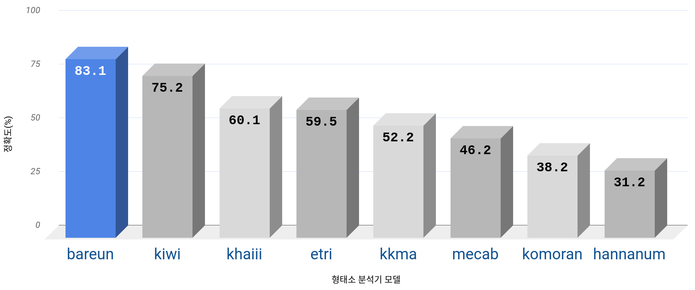

# **1. 한국어 중의성해소 평가 데이터세트**
바른팀에서 구축한 한국어 중의성해소 평가 데이터세트를 소개합니다.<br>
중의성 단어란 서로 다른 문장에서 어절의 표면형이 같고, 의미가 다른 어절을 가리킵니다.<br>
'동음이의어'보다는 넓은 개념으로 용언과 체언의 활용 형태와 곡용 형태까지 포함한다고 볼 수 있습니다.<br>
이러한 중의성을 해소하는 것은 단어 의미 명확화(Word Sense Disambiguation, WSD)라고도 불리며, 자연어 처리의 분야의 오랜 문제입니다.<br>

* 예를 들어, "__용인__", "__트는__"의 경우의 다음과 같은 의미 차이가 있습니다.

  ```
  > 전설속의 용인 이무기의:
     [('용', 'NNG'), ('이', 'VCP'), ('ㄴ', 'ETM')]
  > 용인 제2 캠퍼스를 확대 운영:
     [('용인', 'NNG')]

  > 제가 좋아하는 곡을 트는 것이 원칙이지만:
     [('곡', 'NNG'), ('을', 'JKO'), ('틀', 'VV'), ('는', 'ETM')]
  > 동이 트는 아침 시각에:
     [('동', 'NNG'), ('이', 'JKS'), ('트', 'VV'), ('는', 'ETM')]
  ```

## **중의성해소 평가 데이터 구축**<br>
서울대 국어국문학과 팀에서 모호한 단어의 태깅수정 및 검수과정을 거쳐 문장을 선별하였습니다.<br>
평가 데이터의 단어들이 형태는 같고 의미가 다른 단어의 수가 비슷하도록 선별하였습니다.<br>
표면형이 부족한 단어에 대해선 별도로 문장을 제작하였습니다. 
  * 총 35,396 문장
  * 8,285개의 표면형(가, 가가, 가거나 ...)

아직 완성된 데이터가 아니므로 오류가 있을 수 있습니다.<br>
  * Pull Request 해주시면 Bareun 담당자가 검토후 반영해드리겠습니다.
  * 오류 수정을 요청하시면 contributor 목록에 추가됩니다.

# **2. 중의성해소 평가 데이터세트가 필요한 이유**
형태소 분석은 단어의 구성 요소를 올바르게 분해하는 과정입니다. 단어(어절)를 올바르게 분석하기 위해서는 문장이 가진 문맥을 정확히 이해해야 하고 그 결과를 제대로 평가해야 합니다.<br>
그동안 형태소 분석기의 평가 지표는 기존 학습 말뭉치의 일부를 평가 데이터로 활용하여 측정하였습니다(학습 데이터, 검증 데이터, 평가 데이터 등).
그렇기 때문에 대부분의 형태소 분석기의 성능을 측정하면 자체적으로 98~99% 이상이 되는 경우가 많았습니다.<br>
하지만 기계가 어려워 하는 것을 평가해야지만 성능의 개선 여부를 확인할 수 있으며, 객관적으로 형태소 분석기 성능을 신뢰할 수 있으므로 이러한 평가 데이터 구축의 필요성이 대두되었습니다.<br>
따라서 추론 모델의 입장에서 분석해야할 같은 모양의 어절의 형태가 맥락에 따라서 의미가 달라지는 것을 잘 추론할 수 있는지 평가하는 것이 목적입니다.
* 참고 자료
  * 민지홍, 전준우, 송광호, 김유성(2017), 한국어에 대한 양방향 순환 신경망을 이용한 동형이의어 중의성 해소 연구, 컴퓨터정보논문지, 22-4, 41-49.
  * 강상우(2017), 반복적 기법을 사용한 그래프 기반 단어 중의성 해소, 한국차세대컴퓨팅학회 논문지, 13-2, 102-110.
  * D. Yuan, J. Richardson, R. Doherty, C. Evans & E. Altendorf, “Word Sense Disambiguation with Neural Language Models”, arXivpreprint arXiv:1603.07012,
  * https://bab2min.tistory.com/672


## **평가 결과**


# **3. 설치하기**
* 데이터를 다운로드하고, 중의성 평가 데이터 json파일 생성합니다.
* 위에서 테스트한 결과를 직접 구현해볼 수 있습니다.
* 비교할 형태소 분석기 모델(bareun, konlpy, kiwi, khaiii, mecab)을 설치합니다.
* Ubuntu OS를 기준으로 작성되었습니다.

## **git repository 복사**
* 저장소를 local에 복사합니다.
```
git clone https://github.com/bareun-nlp/korean-ambiguity-data.git
```

## **가상환경 설정**
```bash
python3 -m venv venv
source venv/bin/activate
```

## **필요한 라이브러리 설치**
```
pip install --upgrade pip
pip install bareunpy konlpy kiwipiepy urllib3 tqdm
```

## **데이터세트 json파일 생성**
* data 폴더에 있는 각각의 json파일을 하나의 json 파일로 변환합니다.
```bash
python3 src/make_all_to_one_json.py
```

# **4. 평가해보기**
## **다른 형태소 분석기 설치**
### mecab 설치
```
sudo apt-get install curl git
bash <(curl -s https://raw.githubusercontent.com/konlpy/konlpy/master/scripts/mecab.sh)
```
### khaiii 설치
각 단계별 터미널에 명령어 실행

1. clone
```bash
  git clone https://github.com/kakao/khaiii.git
```

2. build

* 디렉토리 이동 및 생성, cmake 실행
```bash
  cd khaiii
  mkdir build
  cd build
  cmake ..
  make all
  make resource
```
3. testing
* 아래와 같이 khaiii를 실행하고, 테스트 문구 입력
```
 ./bin/khaiii --rsc-dir=./share/khaiii
 바른 형태소 분석기를 사용해보세요
```
* test 코드 입력
```
 ctest
```
4. connect python
```bash
  make package_python
  cd package_python
  pip install  . 
```
## **평가 실행**
* 전체 모델 평가 실행
  * Bareun 모델과 Etri(한국전자통신정보원)모델은 별도의 api-key를 발급받아야 합니다.
  * Bareun 형태소 분석기는 https://bareun.ai/ 에서 회원가입 후 api-key를 발급 받으면 됩니다.
  * Etri api-key는 https://aiopen.etri.re.kr/keyMain 에서 회원가입 후 받아 주시길 바랍니다.
```bash
cd <root of repository>
python3 src/ambiguate_test_models.py -p data -o output/errors -t bareun,kiwi,khaiii,etri,mecab,komoran,hannanum,kkma -bareun your-bareun-api-key -etri your-etri-api-key
```
  * 아직 키를 받지 않은 경우 아래와 같이 다른 모델을 먼저 분석해볼 수 있습니다.
```
python3 src/ambiguate_test_models.py -p data -o output/errors -t kiwi,khaiii,mecab,komoran,hannanum,kkma
```

## **인용하기**
* 아래의 DOI 또는 BibTeX를 통해 인용해주세요.

  * DOI: [](https://doi.org/10.5281/zenodo.7765445)
  * BibTeX:
```BibTeX
@misc{korean-ambiguity-dataset,
author = {Bareun Team},
title = {Korean Morpheme Disambiguation Evaluation Dataset},
year = {2023},
month = {03},
version = {v1.0},
doi = {https://doi.org/10.5281/zenodo.7765445},
journal = {GitHub repository},
note = {\url{https://github.com/bareun-nlp/korean-ambiguity-data}}
}
```

* Cite as

```
Bareun Team. (2023). Korean Morpheme Disambiguation Evaluation Dataset (v1.0) [Data set]. Zenodo. https://doi.org/10.5281/zenodo.7765445
```
